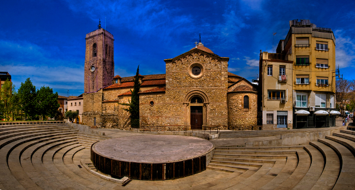

# Neural art transfer

This is my Tensorflow implementation of the Neural Style Transfer technique described in http://arxiv.org/abs/1508.06576 by Gatys *et al*.

The implementation of this technique has been a very good way to learn Tensorflow. I have based my VGG model on the one provided [here](http://www.cs.toronto.edu/~frossard/post/vgg16/) by Davi Frossard.

The optimizer used to create the image that mixes content and style is Adam, and average pooling is used in the VGG network.
Following other artistic style implementations I have also added a total variaton loss to the final loss, but it is disabled by default.

## Usage

First of all you'll need to download the pre-trained VGG16 weights:

```
cd models
./get_models -m vgg
cd ..
```

Then just call the style transfer script:
```
python style-transf.py --cont CONTENT_IMAGE --style STYLE_IMAGE
```

## Script arguments
The available params for the script are the following ones:
- **--iter**: Number of iterations. Default: 1000
- **--cont**: Path of the content image. Default: input/1-content.jpg
- **--style**: Path of the style image. Default: input/1-style.jpg
- **--style**: Path of the output image
- **--lr**: Learning rate. Default: 1.0
- **--cont_w**: Weight of the content loss. Default 1e0
- **--style_w**: Weight for the style loss. Default 1e3
- **--tv_w**: Weight for the total variation loss. Default 0
- **--cont_size**: Resize the content image to the given size. Note that the output mage will have the same size as the content image. Default None
- **--style_size**: Resize the style image to the given size. Default None


## Dependencies
To use the script it is needed:
* Tensorflow
* Numpy & Scipy
* PIL

## Examples




## To Do
- [ ] Content and style layers as arguments 
- [ ] Select model (VGG and Alexnet)
